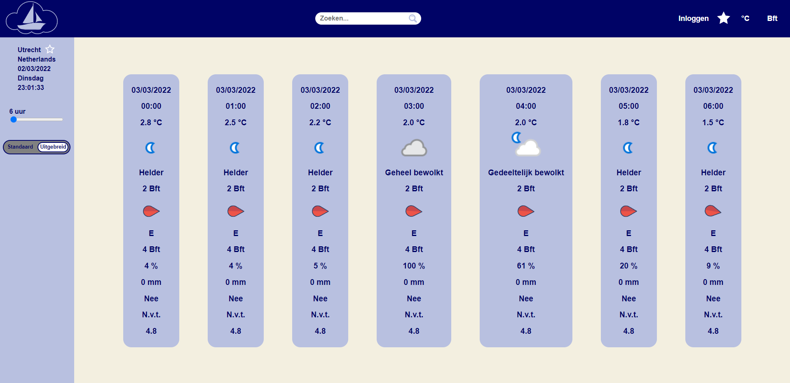

# Installatiehandleiding
Github repository: https://github.com/jasper1196/sailing-app

##Inhoudsopgave
* [Inleiding](#inleiding)
* [BenodigdHeden](#benodigdheden)
  * [API key](#api-key)
  * [Backend](#backend)
  * [Node.js](#nodejs)
* [Installatie](#installatie)
* [Inloggegevens](#inloggegevens)
* [Beschikbare npm commando's](#beschikbare-npm-commandos)

## Inleiding

Met deze applicatie kan de meest relevante weersvoorspelling voor het zeilen worden opgehaald. 
Door middel van de zoekbalk kan een locatie worden opgezocht om de actuele weersvoorspelling op te halen.\
Zoals in de screenshot te zien is wordt de meest relevante informatie weergegeven.

## Benodigdheden

### API key
Er wordt gebruik gemaakt van https://weatherapi.com/ om de weerdata op te halen.\
De API key die hiervoor gebruikt kan worden is: d3da91da0b824e72ac2211303212911\
Indien een API key aangemaakt moet worden, maak dan op https://weatherapi.com/ een account aan en genereer een key.

### Backend
Voor de applicatie wordt de algemeen toegankelijke NOVI backend gebruikt. 
Hiervoor zijn geen inloggegevens beschikbaar.\
Ga naar https://github.com/hogeschoolnovi/novi-educational-backend-documentation/ voor de backend documentatie.

### Node.js
Om de applicatie te kunnen runnen moet Node.js geïnstalleerd zijn op het systeem.\
Ga naar https://nodejs.org/en/download/ om Node.js te installeren.

## Installatie
1. Open een `terminal` venster
2. Ga naar de `project folder`
3. Voer het volgende commando uit `npm install`
4. Open het bestand `.env.dist` 
5. Vul na `REACT_APP_WEATHER_API_KEY` de API key in
6. Ga terug naar het `terminal` venster
7. Voer het volgende commando uit `npm start`
8. Een browservenster opent automatisch waarin de applicatie draait\
_Indien dit niet het geval is ga naar http://localhost:3000/ in je browser._

## Inloggegevens
Er zijn geen bestaande inloggegevens. De backend die wordt gebruikt voor de authenticatie verwijderd ongeveer elk uur alle gegevens.

## Beschikbare npm commando's

In de project folder zijn de volgende commando's beschikbaar:

### `npm start`

Draait de applicatie in de ontwikkel modus.\
Open [http://localhost:3000](http://localhost:3000) om het weer te geven in de browser.

De pagina herlaad wanneer je aanpassingen maakt.\
Ook in de console lint errors weergegeven.

### `npm test`

Start de tester in de interactieve meekijk modus.\
Zie [tests draaien](https://facebook.github.io/create-react-app/docs/running-tests) voor meer informatie.

### `npm run build`

Bouwt de applicatie voor productie naar de `build` folder.\
Het bundelt React in productie modus en optimaliseert voor de beste prestaties.

De build is verkleind en de bestandsnamen worden meegenomen in de hashes.\
De applicatie is klaar om uitgerold te worden!

Zie [uitrollen](https://facebook.github.io/create-react-app/docs/deployment) voor meer informatie

### `npm run eject`

**Pas op: deze operatie is eenmalig en kan niet teruggedraaid worden!**

Indien je niet tevreden bent met de build tool en configruatie keuzen, dan kan je op elk moment `eject` draaien. Dit commando verwijdert de single build dependency uit je project.

In plaats daarvan kopieert het alle configuratiebestanden en dependencies direct in je project zodat je er de volledige controle over hebt. Alle commando's werken nog behalve `eject`, ze wijzen nu echter naar de gekopieerde bestanden. Je kan ze hier ook aanpassen maar je staat er dan wel alleen voor.

Je zal nooit `eject` hoeven gebruiken. De samengestelde functieset is meer dan genoeg dus voel je niet verplicht deze functie te gebruiken. Gebruik het alleen wanneer je er zelf klaar voor bent en de noodzaak ervoor is.
